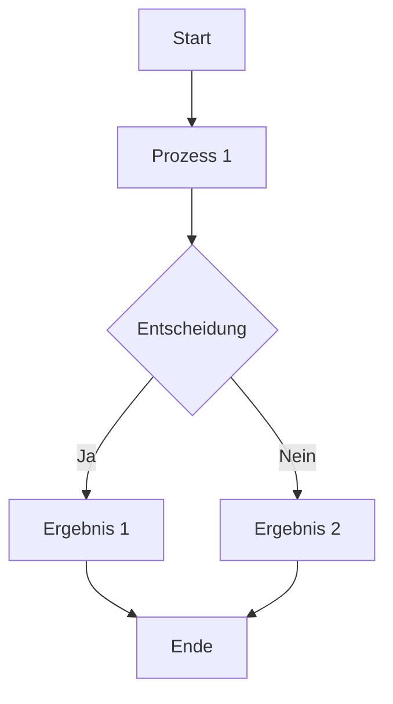
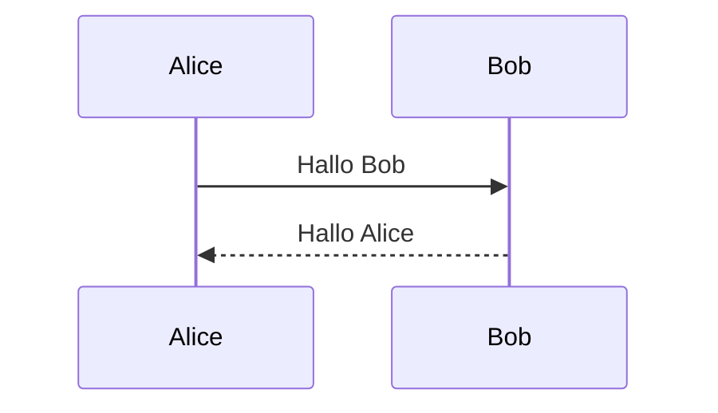
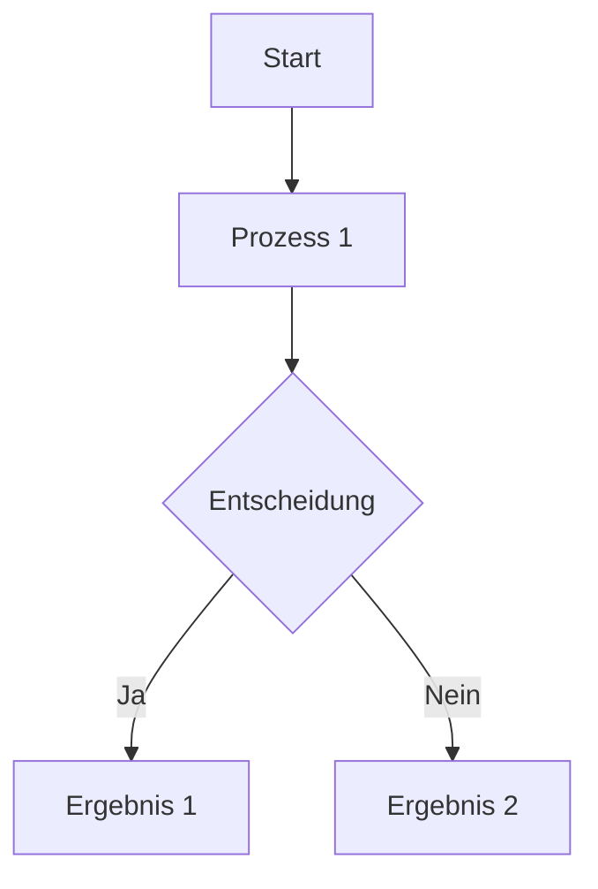

---
{"dg-publish":true,"permalink":"/erste-seite/","tags":["gardenEntry"],"noteIcon":""}
---

# Mega Markdown Beispiel für Obsidian

## Einleitung

Lorem ipsum dolor sit amet, consectetur adipiscing elit. **Nulla facilisi**. Praesent commodo cursus magna, vel scelerisque nisl consectetur et. ~~Sed posuere consectetur est~~ at lobortis. Hier ist ein Link zu [Obsidian](https://obsidian.md).

> "Ein gutes Zitat passt überall hin." – Unbekannt

Ergänzend dazu: Fusce dapibus tellus ac cursus commodo. Cras mattis consectetur purus sit amet fermentum. Integer nec odio. Praesent libero. Sed cursus ante dapibus diam. Sed nisi. Nulla quis sem at nibh elementum imperdiet.

---

## Abschnitt 1: Tabellen

Hier ist eine Tabelle:

| Spalte 1 | Spalte 2 | Spalte 3                    |
| -------- | -------- | --------------------------- |
| Wert 1   | Wert 2   | Wert 3                      |
| **Bold** | *Italic* | [Link](https://example.com) |
| Zeile 3  | Zeile 4  | Zeile 5                    |

Erweiterung der Tabelle:

| Neue Spalte 1 | Neue Spalte 2 |
| ------------- | ------------- |
| Daten 1       | Daten 2       |

---

## Abschnitt 2: Listen

### Geordnete Liste

1. Punkt eins
2. Punkt zwei
   1. Unterpunkt
   2. Unterpunkt
3. Punkt drei
4. Punkt vier

### Ungeordnete Liste

- Punkt A
- Punkt B
  - Subpunkt
  - Subpunkt
- Punkt C
- Punkt D

Zusätzliche Punkte:

- Punkt E
- Punkt F

---

## Abschnitt 3: Codeblöcke

Inline-Code: `print("Hello, World!")`

```python
def greet(name):
    print(f"Hello, {name}!")

greet("Obsidian")

for i in range(5):
    print(i)
```

Erweiterte Beispiele:

```javascript
function greet(name) {
    console.log(`Hello, ${name}!`);
}

greet("Obsidian");
```

---

## Abschnitt 4: Diagramme



Weitere Diagrammideen:



---

## Abschnitt 5: Medien

### Bild


### Video

```markdown
![[BeispielVideo.mp4]]
```

### Audio

```markdown
![[BeispielAudio.mp3]]
```

Weitere Medienideen:

```markdown
![[ZusätzlicheMedien.png]]
```

---

## Abschnitt 6: Callouts

> [!info] Info
> Das ist ein informativer Hinweis.

> [!warning] Warnung
> Achtung, dies ist eine Warnung.

Ergänzende Callouts:

> [!tip] Tipp
> Hier ist ein hilfreicher Tipp.

> [!example] Beispiel
> Dies ist ein konkretes Beispiel.

---

## Abschnitt 7: Iframes

### YouTube Video

```markdown
<iframe width="560" height="315" src="https://www.youtube.com/embed/dQw4w9WgXcQ" frameborder="0" allowfullscreen></iframe>
```

### Webseite

```markdown
<iframe src="https://obsidian.md" width="100%" height="500px"></iframe>
```

Zusätzliche Iframe-Ideen:

```markdown
<iframe src="https://example.com" width="100%" height="400px"></iframe>
```

---

## Abschnitt 8: Aufgaben

- [x] Aufgabe 1
- [ ] Aufgabe 2
- [ ] Aufgabe 3
- [ ] Aufgabe 4: Ergänzung

Zusätzliche Aufgaben:

- [ ] Aufgabe 5: Neue Idee
- [ ] Aufgabe 6: Weiterentwicklung

---

## Abschnitt 9: Mathematische Formeln

Inline: $E = mc^2$

Block:

$$
\int_{0}^{\infty} e^{-x^2} dx = \frac{\sqrt{\pi}}{2}
$$

Weitere Formeln:

$$
a^2 + b^2 = c^2
$$

$$
F = G \frac{m_1 m_2}{r^2}
$$

---

## Abschnitt 10: Tags und interne Links

### Tags

- #Markdown
- #Obsidian/Beispiel
- #NeueIdeen

### Interne Links

- Verweis auf eine andere Notiz: [[Andere Notiz\|Andere Notiz]]
- Verweis auf eine Überschrift: [[Erste Seite#Abschnitt 8: Aufgaben\|#Abschnitt 8: Aufgaben]]
- Verweis auf einen neuen Bereich: [[Neue Notiz\|Neue Notiz]]

---

## Abschnitt 11: Foldable Sections

<details>
<summary>Klicke hier, um mehr zu sehen</summary>

Dies ist ein ausklappbarer Bereich.

- Punkt 1
- Punkt 2
- Punkt 3

Weitere Inhalte:

- Punkt 4
- Punkt 5

</details>

---

## Abschnitt 12: YAML Frontmatter

```yaml
---
Titel: Mega Markdown Beispiel
Autor: Benutzer
Tags: [Obsidian, Markdown, Beispiel]
Datum: 2025-01-26
ZusätzlicheInformationen: Erweiterter Inhalt
---
```

---

## Abschließender Abschnitt

Vielen Dank fürs Testen! 🎉

Lorem ipsum dolor sit amet, consectetur adipiscing elit. Nam at lectus ut tortor placerat vehicula in a neque. Integer nec nulla ac lacus sollicitudin fermentum. Fusce dapibus tellus ac cursus commodo.

Erweiterte Inhalte:

Lorem ipsum dolor sit amet, consectetur adipiscing elit. Pellentesque habitant morbi tristique senectus et netus et malesuada fames ac turpis egestas. Praesent mauris. Fusce nec tellus sed augue semper porta. Mauris massa. Vestibulum lacinia arcu eget nulla.


# Obsidian Markdown Beispiel

## 1. **Textformatierung**
- **Fett:** **Dies ist fett**
- *Kursiv:* *Dies ist kursiv*
- ~~Durchgestrichen:~~ ~~Dies ist durchgestrichen~~
- **_Kombiniert:_** **_Fett und kursiv_**

---

## 2. **Interne Links**
- Link zu einer anderen Notiz: [[Andere Notiz\|Andere Notiz]]
- Link zu einer Überschrift in derselben Notiz: [[Erste Seite#3. Tabellen\|#3. Tabellen]]
- Link zu einer spezifischen Stelle in einer anderen Notiz: [[Andere Notiz#Ein bestimmter Abschnitt\|Andere Notiz#Ein bestimmter Abschnitt]]

---

## 3. **Tabellen**
| Spalte 1       | Spalte 2        | Spalte 3        |
|-----------------|-----------------|-----------------|
| Daten 1        | Daten 2         | Daten 3         |
| **Fett Daten** | *Kursiv Daten*  | [Link](https://obsidian.md) |

---

## 4. **Tags**
- #Ideen
- #Wichtig
- #Markdown/Obsidian

---

## 5. **Checkboxen**
- [x] Aufgabe 1 erledigt
- [ ] Aufgabe 2 in Bearbeitung
- [ ] Aufgabe 3 noch offen

---

## 6. **Bilder und Anhänge**
### Lokales Bild


### Bild von einer URL


---

## 7. **Iframe**
### YouTube Video

<iframe width="560" height="315" src="https://www.youtube.com/embed/dQw4w9WgXcQ" 
frameborder="0" allow="accelerometer; autoplay; clipboard-write; encrypted-media; gyroscope; picture-in-picture" 
allowfullscreen></iframe>


### Webseiten-Einbindung

<iframe src="https://obsidian.md" width="100%" height="500px"></iframe>


---

## 8. **Codeblöcke**
### Inline-Code
`console.log("Hello Obsidian!")`

### Mehrzeiliger Codeblock
```python
def greet():
    print("Hallo, Obsidian!")
greet()
```

---

## 9. **Diagramme mit Mermaid**


---

## 10. **Blockzitate**
> Das ist ein Zitatblock.  
> Unterstützt mehrere Zeilen und Formatierungen.

---

## 11. **Mathematische Formeln**
Inline: \( E = mc^2 \)  
Block:
\[
\int_{0}^{\infty} e^{-x^2} dx = \frac{\sqrt{\pi}}{2}
\]

---

## 12. **Audio und Video**
### Audio
```markdown
![[BeispielAudio.mp3]]
```

### Video
```markdown
![[BeispielVideo.mp4]]
```

---

## 13. **Foldable Sections**
<details>
<summary>Klicke hier, um mehr zu sehen</summary>

Dies ist ein ein- und ausklappbarer Bereich in Obsidian.

- Punkt 1
- Punkt 2

</details>

---

## 14. **Datumsreferenzen**
- Heute: `{{date}}`
- Aktuelle Zeit: `{{time}}`

---

## 15. **Callouts**
> [!info] Hinweis
> Dies ist ein informativer Callout.

> [!warning] Warnung
> Achtung, dies ist ein Warnhinweis.

---

## 16. **Zusammenfassungen (YAML Frontmatter)**
```yaml
---
Titel: Beispiel für Obsidian
Autor: Benutzer
Tags: [Obsidian, Markdown, Beispiel]
Erstellt: {{date}}
---
```

---

Viel Spaß beim Erkunden aller Funktionen in **Obsidian**!


Das Beispiel deckt nahezu alle wichtigen Funktionen ab, die in Obsidian verwendet werden können. Passe es gerne an deine spezifischen Bedürfnisse an!